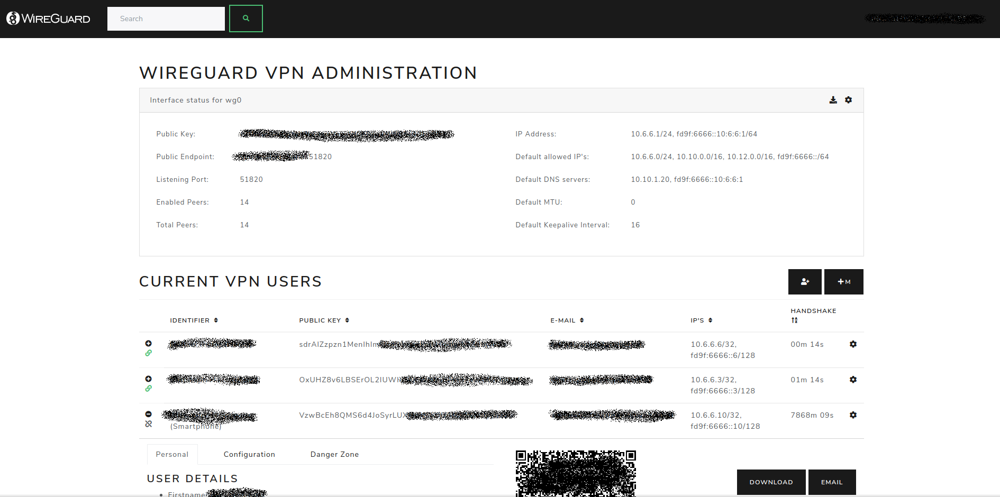

# WireGuard Portal

[](https://travis-ci.com/h44z/wg-portal)
[](https://opensource.org/licenses/MIT)


A simple web base configuration portal for [WireGuard](https://wireguard.com). 
The portal uses the WireGuard [wgctrl](https://github.com/WireGuard/wgctrl-go) library to manage the VPN 
interface. This allows for seamless activation or deactivation of new users, without disturbing existing VPN 
connections.

The configuration portal is designed to use LDAP (Active Directory) as a user source for authentication and profile data.
It still can be used without LDAP by using a predefined administrator account. Some features like mass creation of accounts 
will only be available in combination with LDAP.

## Features
 * Self-hosted and web based
 * Automatically select IP from the network pool assigned to client
 * QR-Code for convenient mobile client configuration
 * Sent email to client with QR-code and client config
 * Enable / Disable clients seamlessly
 * Generation of `wgX.conf` after any modification
 * IPv6 ready
 * User authentication (LDAP and/or predefined admin account)
 * Dockerized
 * Responsive template
 


## Setup

### Docker
The easiest way to run WireGuard Portal is using the provided docker image.

Docker compose snippet with sample values:
```
version: '3.6'
services:
  wg-portal:
    image: h44z/wg-portal:latest
    container_name: wg-portal
    restart: unless-stopped
    cap_add:
      - NET_ADMIN
    network_mode: "host"
    volumes:
      - /etc/wireguard:/etc/wireguard
      - ./data:/app/data
    ports:
      - '8123:8123'
    environment:
      - EXTERNAL_URL=https://vpn.company.com
      - WEBSITE_TITLE=WireGuard VPN
      - COMPANY_NAME=Your Company Name
      - MAIL_FROM=WireGuard VPN <noreply+wireguard@company.com>
      - ADMIN_USER=admin  # optional admin user
      - ADMIN_PASS=supersecret
      - ADMIN_LDAP_GROUP=CN=WireGuardAdmins,OU=Users,DC=COMPANY,DC=LOCAL
      - EMAIL_HOST=10.10.10.10
      - EMAIL_PORT=25
      - LDAP_URL=ldap://srv-ad01.company.local:389
      - LDAP_BASEDN=DC=COMPANY,DC=LOCAL
      - LDAP_USER=ldap_wireguard@company.local
      - LDAP_PASSWORD=supersecretldappassword
```
Please note that mapping ```/etc/wireguard``` to ```/etc/wireguard``` inside the docker, will erase your host's current configuration.
If needed, please make sure to backup your files from ```/etc/wireguard```.
For a full list of configuration options take a look at the source file [internal/common/configuration.go](internal/common/configuration.go).

### Standalone
For a standalone application, use the Makefile provided in the repository to build the application.

```
make

# To build for arm architecture as well use:
make build-cross-plat
```

The compiled binary and all necessary assets will be located in the dist folder.
A detailed description for using this software with a raspberry pi can be found in the [README-RASPBERRYPI.md](README-RASPBERRYPI.md).

## What is out of scope

 * Generation or application of any `iptables` or `nftables` rules
 * Setting up or changing IP-addresses of the WireGuard interface on operating systems other than linux
 
## Application stack

 * [Gin, HTTP web framework written in Go](https://github.com/gin-gonic/gin)
 * [go-template, data-driven templates for generating textual output](https://golang.org/pkg/text/template/)
 * [Bootstrap, for the HTML templates](https://getbootstrap.com/)
 * [JQuery, for some nice JavaScript effects ;)](https://jquery.com/)

## License

 * MIT License. [MIT](LICENSE.txt) or https://opensource.org/licenses/MIT
 

This project was inspired by [wg-gen-web](https://github.com/vx3r/wg-gen-web).